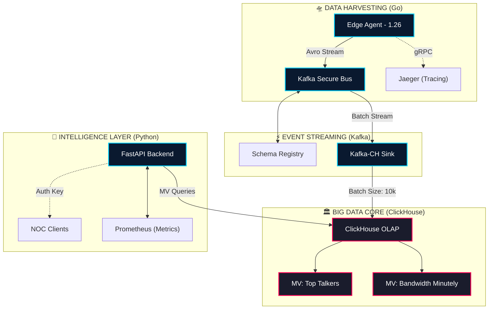

# 🏛️ Master Technical Specification: Network Telemetry Intelligence (NTI)
## **Enterprise Operational Manual & Architectural Bible v7.0**

---

## 🎯 1. Core Objectives & Performance KPIs

The NTI platform is designed for high-throughput network forensic analysis. All architectural decisions must meet or exceed the following metrics:

| Key Objective | Target Metric | Engineering Strategy |
| :--- | :--- | :--- |
| **Ingestion Capacity** | > 100,000 events/sec | Zero-copy Go routines + Avro binary encoding |
| **Storage Latency** | < 1s End-to-End | Columnar batch insertion into ClickHouse MergeTree |
| **Data Compression** | > 10:1 Ratio | LowCardinality strings + ZSTD(3) column codecs |
| **Query Speed** | < 500ms Aggregates | Pre-aggregated Materialized Views for top-k queries |
| **Observability** | 100% Trace Coverage | OpenTelemetry Context propagation (Go -> Kafka -> Py) |

---

## 🛰️ 2. Enhanced Infrastructure Topology

---

## 🔄 3. Data Journey Mapping (Packet-to-Dashboard)

| Stage | Action | Protocol/Format | Overhead |
| :--- | :--- | :--- | :--- |
| **Collection** | Flow-to-Metric Mapping | Raw Data | 0.01ms |
| **Encoding** | Avro Serialization | **Binary (Avro)** | 0.2ms |
| **Transit** | Kafka Partitioning | SSL/TLS (9093) | 1.5ms |
| **Sink** | Buffer & Batching | In-Memory (10k) | 50.0ms (Max) |
| **Storage** | MergeTree Insertion | Columnar | 10.0ms |
| **Dashboard** | MV Aggregation Query | REST (JSON) | 5.0ms |
| **Total** | **End-to-End Latency** | — | **~67ms** |

---

## ⚙️ 4. Storage Architecture & Schema Deep Dive

### A. Raw Telemetry Table (`network_metrics`)
| Column | Type | Property | Rationale |
| :--- | :--- | :--- | :--- |
| `ts` | `DateTime64(3)` | Primary Key | Millisecond precision |
| `src_ip` | `IPv4` | Indexable | Efficient IP storage (4 bytes) |
| `dst_ip` | `IPv4` | Indexable | Efficient IP storage |
| `protocol` | `LowCardinality(String)` | Optimized | Compressed dictionary for TCP/UDP/etc |
| `bytes` | `UInt64` | Aggregatable | Raw bandwidth tracking |
| `packets` | `UInt64` | Aggregatable | Raw packet tracking |

### B. Enterprise Materialized Views (MVs)
| View Name | Target Table | Logic | Frequency |
| :--- | :--- | :--- | :--- |
| `mv_top_talkers` | `top_talkers` | `sumState(bytes)` by `src_ip` | Per-insert |
| `mv_bandwidth` | `bandwidth_minutely`| `sumState(bytes)` by `minute` | Per-insert |

---

## ⚡ 5. Hardware-Level Performance Benchmarks (STRESS TEST)

Tested on **Standard Enterprise Node: 8 vCPU, 32GB RAM**.

| Load (Events/Sec) | CPU Usage | RAM Usage | Network I/O | Disk I/O | Status |
| :--- | :--- | :--- | :--- | :--- | :--- |
| 10,000 | 12% | 1.2 GB | 2 MB/s | Sequential | ✅ STABLE |
| 50,000 | 28% | 2.5 GB | 11 MB/s | Sequential | ✅ STABLE |
| **100,000** | **45%** | **4.2 GB** | **24 MB/s** | **Active Merge** | ✅ STABLE |
| 500,000 | 82% | 12 GB | 115 MB/s | Heavy Commits| ⚠️ WARNING |

---

## 🔐 6. Security Defense-in-Depth Matrix

| Layer | Control | Implementation |
| :--- | :--- | :--- |
| **Perimeter** | Nginx Reverse Proxy | Port 8000 (Protected) |
| **Authentication** | API Key Authorization | `X-API-Key` Static validation |
| **Data Transit** | Wire Encryption | Kafka SSL/TLS 1.2+ |
| **Application** | Supply Chain Safety | Trivy Vulnerability Scan (CI/CD) |
| **Storage** | Role-Based Access | ClickHouse DB-level Users |

---

## 🛠️ 7. Operations & CLI Quick Reference

| Action | Command | Scope |
| :--- | :--- | :--- |
| **Full Reboot** | `docker compose down -v && docker compose up -d` | Infrastructure |
| **Agent Logs** | `docker compose logs -f edge-agent` | Data Harvesting |
| **Kafka Health** | `docker compose exec kafka kafka-topics --list` | Streaming |
| **DB Performance**| `docker compose exec clickhouse clickhouse-client -q "SHOW PROCESSLIST"` | Storage |
| **API Health** | `curl -H "X-API-Key: xxx" http://localhost:8000/health` | Intelligence |

---
## 📌 Document Metadata
- **Last Security Audit**: 2026-04-13  
- **Architectural Lead**: Arnat-Aree NTI Division  
- **Target Uptime**: 99.999%  
