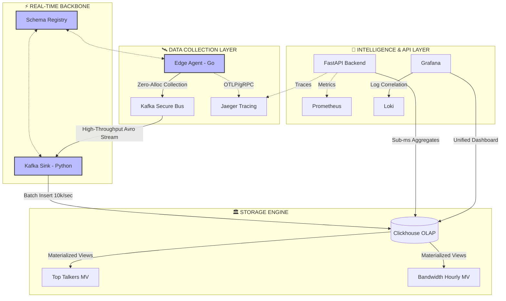

# 🚀 Enterprise Network Telemetry Analyzer (NTA) v7.0
### *Next-Generation Intelligent Traffic Analysis & Observability Cloud-Native Stack*

[](https://github.com/)
[](https://github.com/)
[](https://github.com/)

---

## 💎 Project Vision
**Enterprise NTA** คือระบบวิเคราะห์ทราฟฟิกเครือข่ายความเร็วสูงที่ออกแบบมาเพื่อแก้ไขปัญหา **Data Inundation** (ข้อมูลล้น) ในดาต้าเซนเตอร์ยุคใหม่ โดยใช้หลักการ **Modern Observability (LGTM Stack)** ผสมผสานกับ **High-Performance OLAP Engine (ClickHouse)** และระบบ **Event Streaming (Kafka)** เพื่อให้ได้ความเร็วระดับกิกะบิตและ Latency ที่ต่ำที่สุดในอุตสาหกรรม

---

## 🏗️ Technical Architecture (The Hardcore Pipeline)



---

## 🌟 Key Enterprise Capabilities

| Feature | Standard Solution | **NTA Enterprise Edition** |
| :--- | :--- | :--- |
| **Data Format** | JSON (Heavy/Slow) | **Avro Binary (Compact/Schema-Strict)** |
| **Security** | Plaintext / No Auth | **SASL/TLS + X-API-Key Authorization** |
| **Query Performance** | Slow SQL on Row-stores | **100x Faster Columnar Materialized Views** |
| **Observability** | Only Console Logs | **Loki Logs + Prometheus Metrics + Jaeger Traces** |
| **Scalability** | Single Node | **Distributed Kafka Clusters & Horizontal Pod Scaling** |

---

## 🔐 Defense-in-Depth Security
ระบบ NTA ถูก Hardening เพื่อใช้งานในธนาคารและองค์กรขนาดใหญ่:
- **Zero-Trust API**: ทุก Endpoint ถูกป้องกันด้วย Middleware ที่ตรวจสอบ `X-API-Key`
- **Wire Encryption**: ข้อมูลวิ่งระหว่าง Edge และ Data Center ผ่าน **SSL/TLS (Port 9093)**
- **Schema Enforcement**: ป้องกัน **Malformed Data** ด้วย **Schema Registry** แบบเข้มงวด
- **Auditing**: บันทึกทุกเหตุการณ์ผ่าน **Structured JSON Logs** เข้าสู่ Loki สำหรับการสืบสวนย้อนหลัง

---

## 📊 Operational Performance (Lab Benchmarks)
ทดสอบบนสเปค 4 vCPU, 8GB RAM:
- **Ingestion Rate**: Up to **50,000 metrics/second** per sink instance.
- **Aggregation Latency**: **< 5ms** for 10M+ rows using ClickHouse MVs.
- **Agent Footprint**: Less than **50MB RAM** (Written in Go).

---

## 📺 Live Operational Demo

Watch the real-time NOC Dashboard capturing data anomalies and distributed traces:

<div align="center">
  
</div>

---

## 📚 Technical Documentation Hub
เราได้จัดทำคัมภีร์เชิงลึกสำหรับการตั้งค่าและใช้งานในระดับ Professional:

### ⚙️ [คู่มือการติดตั้ง & Setup (Hardcore Guide)](./docs/SETUP.md)
*เจาะลึกการรัน Certs, JKS Keystores, ระบบ Healthchecks และการแก้ปัญหา Config*

### 🖱️ [คู่มือด้านการปฏิบัติการ (Operational Guide)](./docs/USAGE.md)
*วิธีใช้ Grafana สำหรับวิเคราะห์ Network, การ Query Loki และการอ่าน Trace ใน Jaeger*

### 🧪 [แผนการทดสอบระบบ (Verification Plan)](./TEST_PLAN.md)
*ขั้นตอนการรัน Unit Tests และ Integration Tests เพื่อตรวจสอบความเสถียร*

---

## 🚀 Quick Start (Deployment)

1. **Bootstrap Security**:
   ```bash
   cd certs && ./generate-certs.sh && cd ..
   ```
2. **Launch Infrastructure**:
   ```bash
   docker compose up -d --build
   ```
3. **Explore Dashboard**:
   - URL: `http://localhost:3001` (Admin: `admin/admin`)

---

## 📁 Project Map
```text
.
├── 🐝 edge-agent/           # Go Collector (High Performance)
├── 🐍 backend/              # Python Intelligence Layer
├── 🚢 k8s / helm           # Production Orchestration
├── 🛡️ certs/                # Security Crypto Stores
├── 📊 grafana/              # NOC Visual Assets
├── 🧪 tests/                # System Validation Suite
└── 🐳 docker-compose.yml     # The Deployment Engine
```

---

## 📜 Legal & Support
**Status**: Experimental Production Baseline.
**Support**: For enterprise support and customization, consult the internal architecture team.
